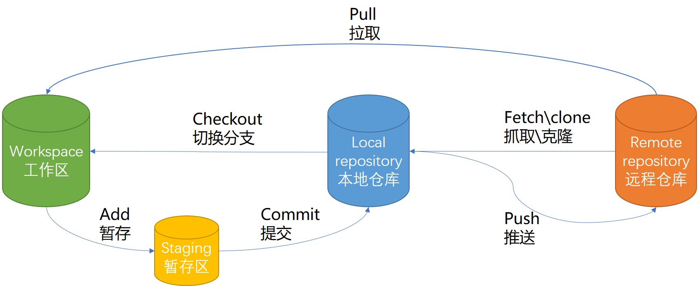

# git的安装
## windows

在[官网](https://git-scm.com/downloads)下载与系统对应的版本安装包, 安装过程参照[教程](https://blog.csdn.net/mukes/article/details/115693833), 基本就是全程next

## linux
直接使用apt安装命令
```
sudo apt-get install git
```

# 配置git用户名与邮箱
```
git config --global user.name "Your Name"
git config --global user.email "email@example.com"
```
配置的用户名和邮箱对push代码到远程仓库时的身份验证没有作用，即不用他们进行身份验证；他们仅仅会出现在远程仓库的commits里。仅仅是为你提交代码时附加的身份说明, 为了后期查证方便, 应设置正确信息。[来源](https://blog.csdn.net/ITWANGBOIT/article/details/103618427)

但也有文章指出不设置会造成生成密钥无法使用。[来源](https://blog.csdn.net/weixin_41695715/article/details/119149546)

# 生成私钥和公钥以及代码托管平台创建ssh_key

## windows
```
ssh-keygen -t rsa # 执行生成私钥和公钥的命令,连续回车确认。 生成位置默认在user/user_name下的.ssh

```

## linux
```
ssh-keygen -t rsa # 默认位置在用户目录的.ssh中
```
生成的公钥用于生成代码托管平台的ssh_key

按照图示为代码托管平台生成ssh_key


# 与远程仓库同步
```
git init # 将本地文件夹 git 初始化
git add . # 将本地文件进行添加, . 是全部文件, 可以通过具体文件名进行添加。添加是添加到本地缓存区
git commit -m "提交说明" # 将缓存区的文件进行提交, 并加上提交说明
git branch -M main # -m的作用是重命名, 此处应该是创建一个名为main的分支
git remote add origin git@github.com:zhangjingxian1998/some_note.git # 添加远程分支, 分支名称为oring, 后面的网址是git仓库
git push -u origin main # 推送分支到远程,-u 参数的意思是将这个远程分支设为本地分支的 upstream（上游），以后的 push 或 pull 可以直接使用 git push 或 git pull 命令。如果不使用 -u 参数，则需要在每次 push 或 pull 命令后指定远程分支名。
```

# 对仓库进行更新，采用创建分支，在分支中更改，然后合并分支到main分支的形式
```
git branch dev # 创建名为dev的分支 (develop:开发)
git checkout dev # 切换到新建分支，在该分支上进行更改
git checkout main # 更改完后切换回主分支
git branch merge dev # 将更改玩的分支融合进主分支
git push # 融合后推送到远程仓库
git branch -d dev # 删除分支
```

# 多人协同开发

# git 工作流程

# .gitignore

# git指令详解
```
1、git init 
会将一个本地文件夹转换为git形式, 在执行命令的文件夹下会生成一个.git文件夹
2、git add
将更改后的文件添加进缓存区
git add -p 可以选择添加哪部分代码而略过哪部分代码
3、git commit
将缓存区内的文件进行提交
4、git branch
git branch -m/M <old_branch_name> <new_branch_name>
5、git merge
将某个分支融合到当前分支
git merge <merged_branch_name>
6、git push
7、git pull
```