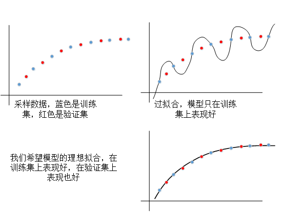

概念说明<br>
数据集，数据集是从真实世界中采集到数据，对于图像数据集而言是由相机拍摄的图片。
从世界中采集到一定数量的数据后，要将其划分为训练集、验证集和测试集。划分出三部分的目的是在训练模型的同时，对训练效果进行评估。只有当输入训练集图像时，模型参数才会去更新，也就会有一种可能，模型训练过头了，只在训练集上表现好。<br>
<br>
batch size（批大小）
一个数据集可能有成千上百的图片，如果一张一张地输入到模型中计算效率会很低，造成GPU计算资源浪费。设置batch size大小控制每次输入到模型中计算的图片张数，最大限度利用计算资源。同时，多张图片同时指导梯度更新方向，也能加快模型收敛速度。

iteration，迭代，每次向模型输入一个batch，模型会进行一次参数更新，称为一个iteration。假设训练集有1000张图片，batch size设置为2，会进行$1000/2=500$次迭代。

epoch，训练代数，继承上述假设，每进行500次迭代，称为一个epoch。通常会多训练几个epoch，有的较大的模型会训练几百个epoch。<br>

1、梯度下降<br>
以一个最简单的例子开始，假设世界能够被一个一元一次函数表述，即$y=\alpha x$，x是在世界中采集的信息，y是对x的标注。<br>
在世界中进行随机采样，采样到<mark>$x=2,\bar y=4$</mark><br>
身处三维世界，我们可以很容易地计算出$\alpha=2$，但考虑到世界能够被一个一元一次函数表示，我们也必然不可能计算出这个结果。所以需要利用一些其他方法<br>
我们是不知道$\alpha$具体是多少的，也不懂得计算方法。但考虑到$\alpha$也仅仅是一个数轴上的数，其只会变大或者变小。<br>
我们先假设$\alpha=1$，此时计算出$y=2$，与采样标注值相差2。再将$\alpha$减小一点儿，$\alpha=0.9$，此时计算出$y=1.8$，与采样标注值相差2.2，距离变得更远了，说明我们参数更新的方向错了。那么重新设置$\alpha$为1，接下来把$\alpha$增大一点儿，$\alpha=1.1$，此时计算出$y=2.2$，与采样标注之相差1.8，距离变得更近了。所以接下来要做的事就是一点点儿的增大$\alpha$，直到计算出来的结果和采样标注结果一致或者相差接近一定阈值。<br>
那么回到我们的真实世界，肯定不可能仅仅用一个一元一次函数来表示，必定是一个由超多参数组成的复杂函数来表示。这样的一个函数我们并不清楚它具体是什么样子的，但由超多参数组成是肯定的。假设这个能够表达世界的函数由$n$个参数组成，使用我们刚才的方法，先给n个参数进行一个初始化。接下来确定每个参数是应该增加还是减少。每个参数有增加和减小这两种种可能状态，n个参数就是有$2^n$个状态，假设计算一次需要10ms，确定一次更新参数的方向就需要$0.01*2^n$秒。那么只有10个参数的模型，更新一次就要10s。每多一个参数耗时就要多一倍，指数增加。如果模型由100个参数构成，就要$10^{28}$秒才能确定一次模型参数的变化，算到宇宙爆炸都算不完一次。<br>

因此，我们需要一种东西来指导每个参数朝着合适的方向去更新，那就是梯度。<br>

再次回到我们最初始的假设$\alpha=1$，此时计算出$y=2$。定义损失函数为$\Delta L=(\bar y-y)^2$，其中$\bar y$是标注值。

通过$\Delta L$对我们希望更新的参数$\alpha$求偏导

$\frac{\delta L}{\delta y}=-2(\bar y-y)$。

$\frac{\delta L}{\delta \alpha}=\frac{\delta L}{\delta y}\frac{\delta y}{\delta \alpha}=-2(\bar y-y)x$<br>
可以看到梯度值只跟计算差值和采样值有关系。

我们用来衡量计算值y和标注值$\bar y$差距的函数是二次函数，在正实数域中，越接近梯度越小，差距大时梯度大。梯度方向指向数轴增加的方向，所以要让跟标注值之间的差距越来越小，就要朝着梯度的逆方向更新。<br>

当$\alpha=1$时，损失值为4，参数$\alpha$的梯度值为$\frac{\delta L}{\delta \alpha}=-2*(4-2)*2=-8$，更新$\alpha=1-(-8)=9$。这明显是相当错误的结果，$\alpha$是应该增大，但不应该增大那么多。因此我们需要引入一个超参数来限制$\alpha$的更新速度。

引入一个学习率参数$\beta=0.1$<br>

----------------epoch0------------------<br>
----------------iteration 0-------------<br>
当$\alpha=1$时（模型初始化）<br>
计算结果是2（前向传播）<br>
损失值为4（使用定义的损失函数计算）<br>

梯度值为$\frac{\delta L}{\delta \alpha}=-2*(4-2)*2=-8$（对应程序里的```loss.backward()```）<br>

更新$\alpha=1-(-8)*\beta=1.8$（调用优化器更新参数，对应程序里的```optimizer.step()```）<br>
```loss.backward()和optimizer.step()是自动实现的，不需要我们操心```
进行完这一步就完成了一次迭代。由于我们的数据集只有1个，即x=2时y=4，因此这个epoch也完成了。进入下一个epoch。如果有多个数据的话，iteration会多几个。<br>

----------------epoch1------------------<br>
----------------iteration 1-------------<br>
当$\alpha=1.8$时，计算结果是3.6，损失值为0.16，梯度值为$\frac{\delta L}{\delta \alpha}=-2*(4-3.6)*2=-1.6$ <br>

更新$\alpha=1.8-(-1.6)*\beta=1.96$ <br>

----------------epoch2------------------<br>
----------------iteration 2-------------<br>
当$\alpha=1.96$时，计算结果是3.92，损失值为0.0064，梯度值为$\frac{\delta L}{\delta \alpha}=-2*(4-3.92)*2=-0.32$ <br>

更新$\alpha=1.96-(-0.32)*\beta=1.992$。

可以看到$\alpha$越来越逼近于目标值2。<br>

对应到posecnn上，无非就是由一个参数$\alpha$变成了posecnn的参数集合${\theta}$<br>
输入由$x$的一个数字变成了图像矩阵（实际上还是数字，只是数字个数变多了）。<br>
输出由$y$的一个数字变成了期望输出的样子。（实际上还是数字，只是数字个数变多了）。<br>
标注由$\bar y$的一个数字变成了图像数据的标注（实际上还是数字，只是数字个数变多了）。<br>
损失函数由一个$\Delta L=(\bar y-y)^2$变成了多种损失函数的组合。<br>