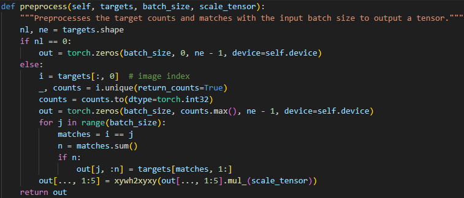
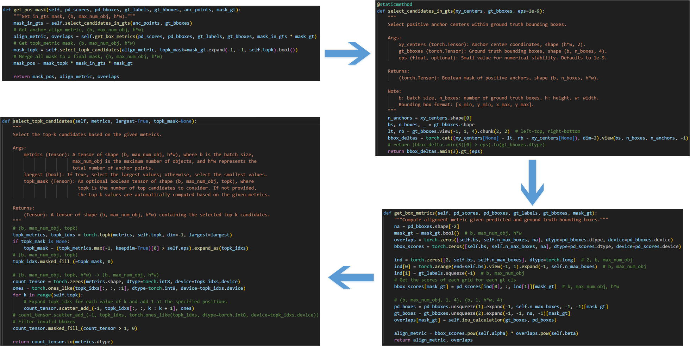
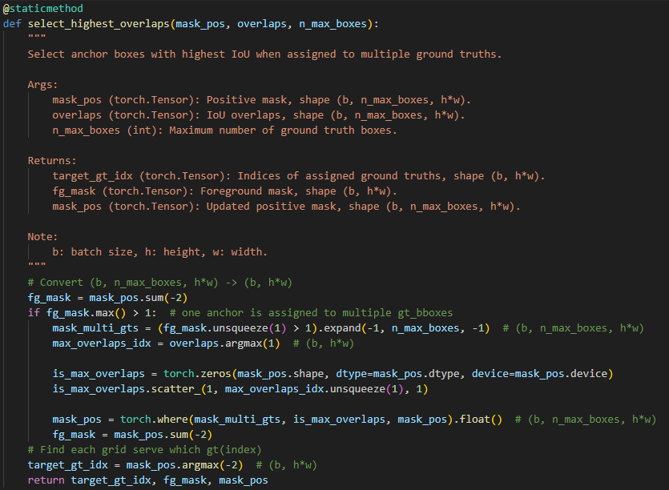

## 1. 创建anchor point
```python
make_anchors(feats, self.stride, 0.5)
```
其构建的anchor point是代表着中心点，从0.5开始，步长为1.<br>


## 2. gt值预处理
将其从归一化的xywh转化为原始框的坐标xyxy<br>


## 3. 计算每个anchor预测的框
channel是64，为每个anchor的上下左右预测16个偏移概率，在[0,15]上积分，得到每个anchor的上下左右的偏移值。再在anchor point坐标上对这四个方向进行偏移，返回xyxy形式。<br>


## 4. gt框分配
为每个gt框分配topk个预测框来进行损失计算。<br>


1. 只保留存在于gt框内的anchor point
2. 计算每个anchor point与gt框的iou,记为overlap。再计算分类得分和iou的加权和作为分配得分align_metric
3. 为每个gt框取topk个iou最大的anchor point



4. 如果有预测的anchor框匹配了多个gt框，则只保留iou最大的那个匹配结果。



5. 根据上述计算结果，进行gt和anchor point预测框的分配。


## 5. 计算损失

分类损失使用bce损失
回归损失使用CIoU损失和DFL损失

CIoU损失

$L_{CIoU} = 1 - IoU + \frac{\rho^2(b, b^g)}{c^2} + \alpha v$

1. $IoU$ 是交并比（Intersection over Union）。

2. $\rho$(b, b^g) 是两个边界框中心点之间的欧几里得距离。

3. $c$ 是最小包围框（convex hull）的对角线长度。

4. $v$ 是衡量长宽比一致性的度量：计算的是预测框和gt框的宽高比率，如果二者宽高比相差较大，则v值大。

$v = \frac{4}{\pi^2} \left( \tan^{-1} \frac{w^g}{h^g} - \tan^{-1} \frac{w}{h} \right)^2
$

$\alpha = \frac{v}{(1 - IoU) + v}$

DFL损失
先将gt框转换为对应anchor朝上下左右四个方向的偏移。将偏移量限制在设定的reg_max范围内。
然后对偏移量左右取整。比如说第一个gt框的上偏移量计算出来是5.3，那么tl=5,tr=6,wl=0.7,wr=0.3。

