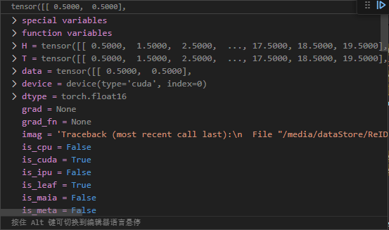
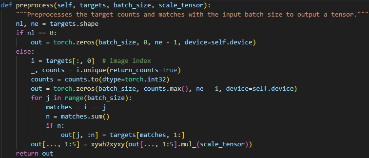
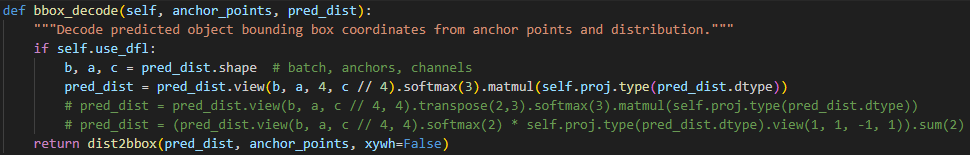
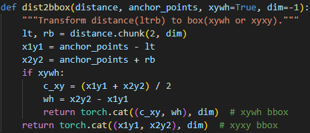
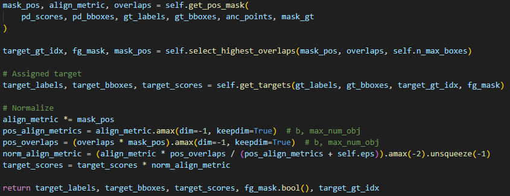
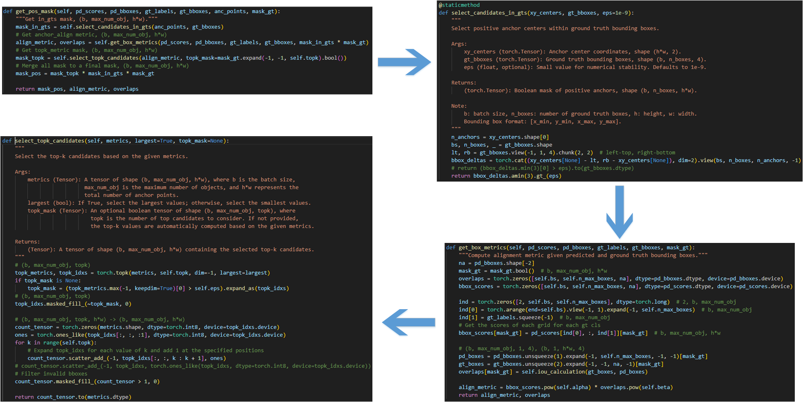
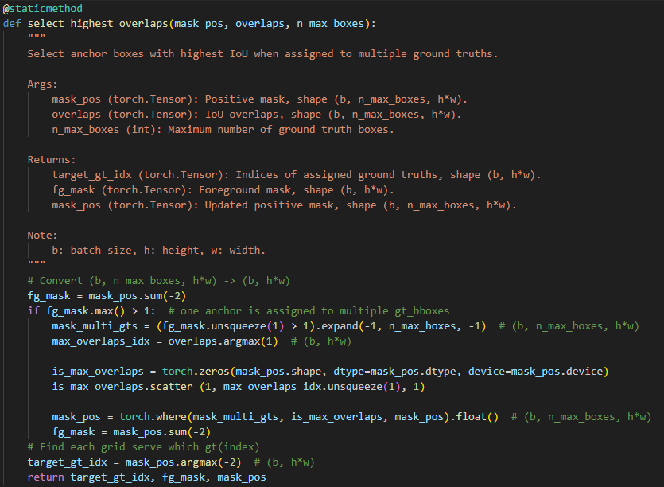
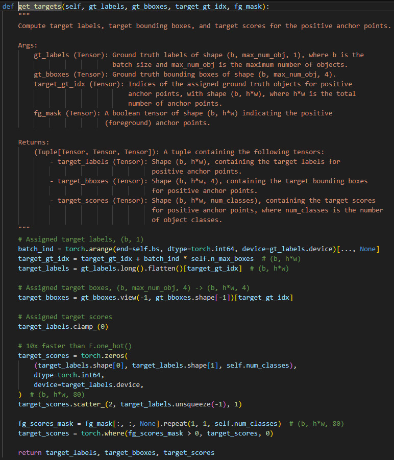
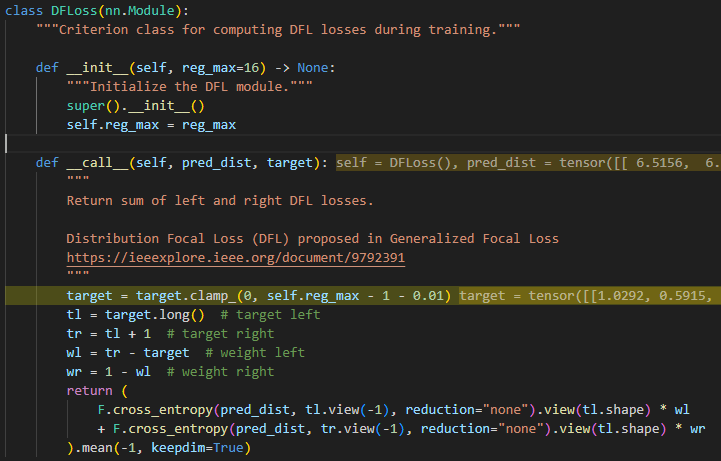

yolox的三个预测头输出
为每个anchor point分别预测[中心点偏移量，宽高]，有无目标置信度，类别置信度。

yolo11的预测头输出
预测anchor point距离框上下左右边界的距离和类别置信度

由于anchor point数量众多，需要设定一种匹配机制，为每个gt框分配一个最合适的预测框，这样才能计算预测损失，达到学习的目的。

# yolox
匹配时需要知道每个anchor point对应预测框的代价值。
代价值由3部分构成。
1. box_iou：anchor point与gt框的iou。
2. cls_score：anchor point的类别置信度和有无目标置信度的乘积。
3. in_box_center：anchor需要位于gt框中心点附近，且落入gt框内。如果anchor point不满足这个要求，则代价值设为无穷大。

然后按照每个gt框和每个anchor point对应预测框的代价值，选择代价值最小的预测框为该gt框的预测框。每个gt框最多匹配10个预测框，最少匹配1个预测框。

如果某个预测框被分配给多个gt框，则按照代价值最小原则分配gt框。

计算损失时，预测中心点偏移和宽高的网络头使用IoU损失监督学习，两个预测置信度的网络头用bce损失监督学习。

# yolo11
而对于yolo11来说，由于不需要考虑中心点是否落于gt中心点范围内，只需要考虑anchor point是否落在gt框内即可。

根据每个gt框和每个anchor point的IoU和类别置信度，计算出每个anchor point的得分值。

为每个gt框分配topk个预测框，如果有某些预测框被分配给多个gt框，则按照得分值最大原则分配gt框。

## 1. 创建anchor point
```python
make_anchors(feats, self.stride, 0.5)
```
其构建的anchor point是代表着中心点，从0.5开始，步长为1.<br>


## 2. gt值预处理
将其从归一化的xywh转化为原始框的坐标xyxy<br>


## 3. 计算每个anchor预测的框
channel是64，为每个anchor的上下左右预测16个偏移概率，在[0,15]上积分，得到每个anchor的上下左右的偏移值。再在anchor point坐标上对这四个方向进行偏移，返回xyxy形式。<br>



## 4. gt框分配
为每个gt框分配topk个预测框来进行损失计算。<br>


1. 只保留存在于gt框内的anchor point
2. 计算每个anchor point与gt框的iou,记为overlap。再计算分类得分和iou的加权和作为分配得分align_metric
3. 为每个gt框取topk个iou最大的anchor point



4. 如果有预测的anchor框匹配了多个gt框，则只保留iou最大的那个匹配结果。



5. 根据上述计算结果，进行gt和anchor point预测框的分配。



## 5. 计算损失

分类损失使用bce损失
回归损失使用CIoU损失和DFL损失

CIoU损失

$L_{CIoU} = 1 - IoU + \frac{\rho^2(b, b^g)}{c^2} + \alpha v$

1. $IoU$ 是交并比（Intersection over Union）。

2. $\rho$(b, b^g) 是两个边界框中心点之间的欧几里得距离。

3. $c$ 是最小包围框（convex hull）的对角线长度。

4. $v$ 是衡量长宽比一致性的度量：计算的是预测框和gt框的宽高比率，如果二者宽高比相差较大，则v值大。

$v = \frac{4}{\pi^2} \left( \tan^{-1} \frac{w^g}{h^g} - \tan^{-1} \frac{w}{h} \right)^2
$

$\alpha = \frac{v}{(1 - IoU) + v}$

DFL损失
先将gt框转换为对应anchor朝上下左右四个方向的偏移。将偏移量限制在设定的reg_max范围内。
```python
def bbox2dist(anchor_points, bbox, reg_max):
    """Transform bbox(xyxy) to dist(ltrb)."""
    # bbox xyxy
    x1y1, x2y2 = bbox.chunk(2, -1)
    return torch.cat((anchor_points - x1y1, x2y2 - anchor_points), -1).clamp_(0, reg_max - 0.01)  # dist (lt, rb)
```
然后对偏移量左右取整。比如说第一个gt框的上偏移量计算出来是5.3，那么tl=5,tr=6,wl=0.7,wr=0.3。

