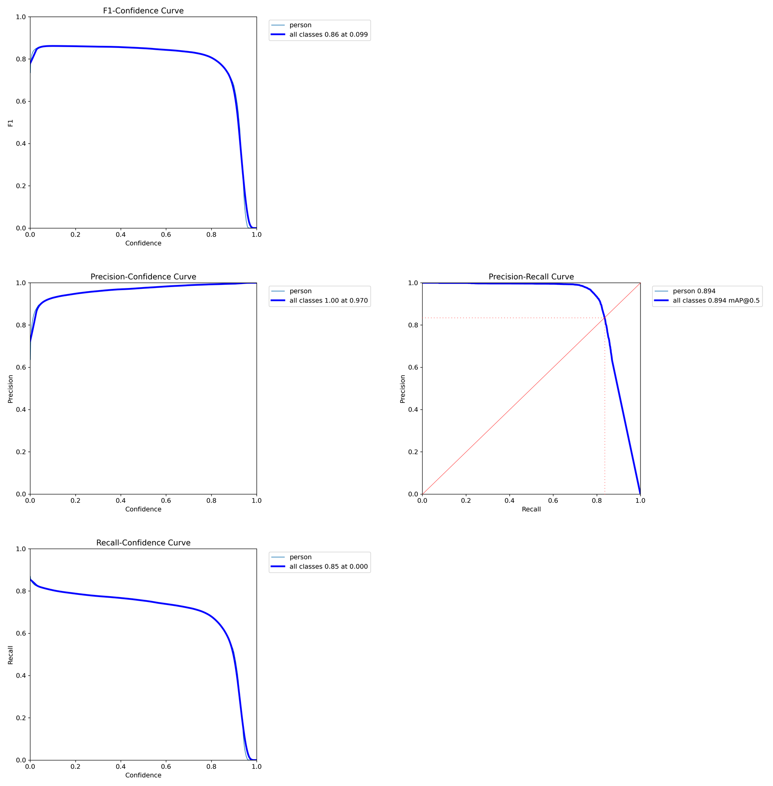
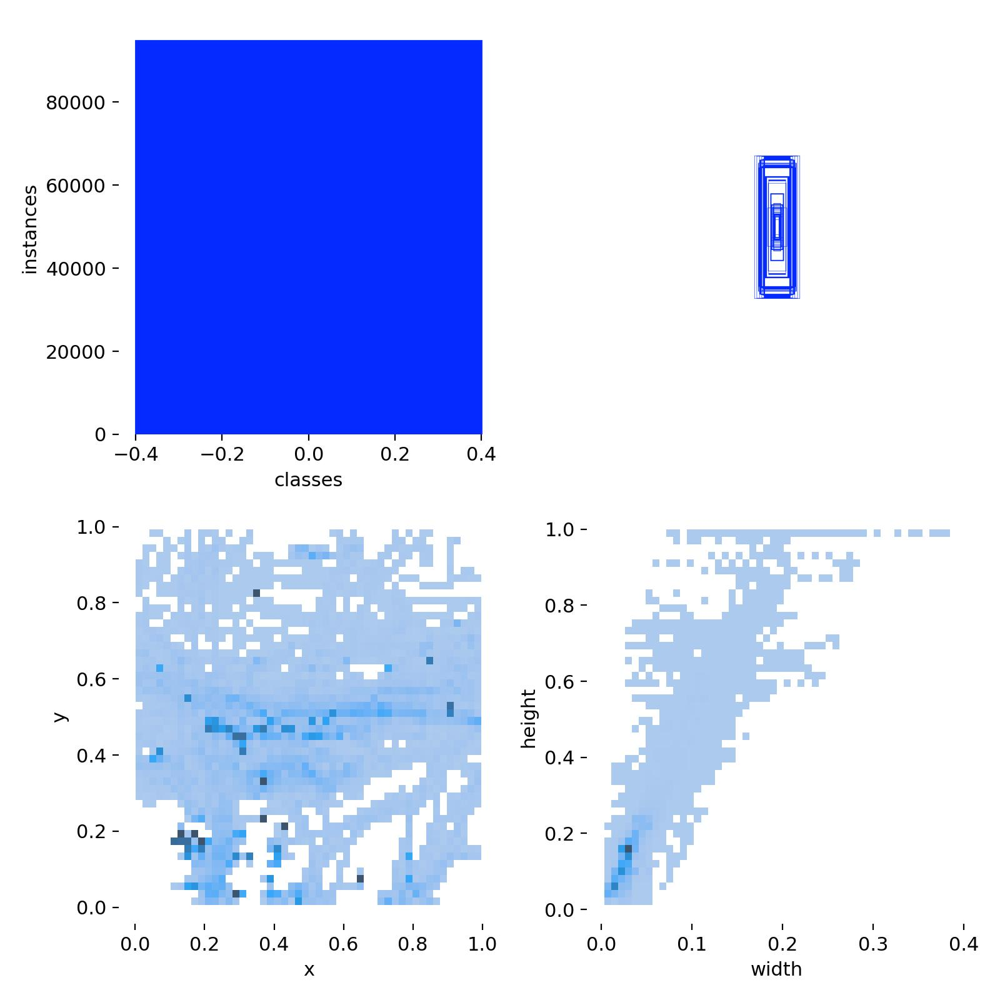
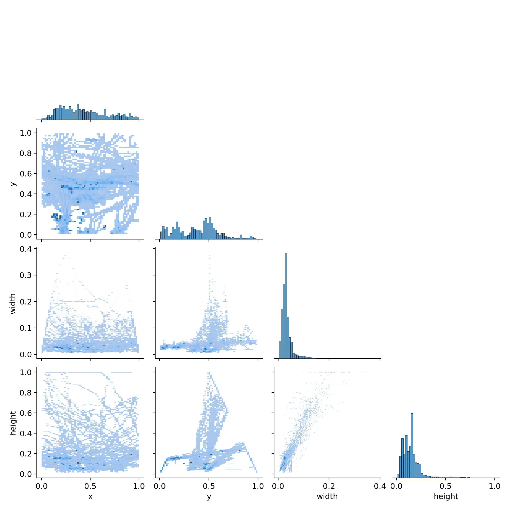
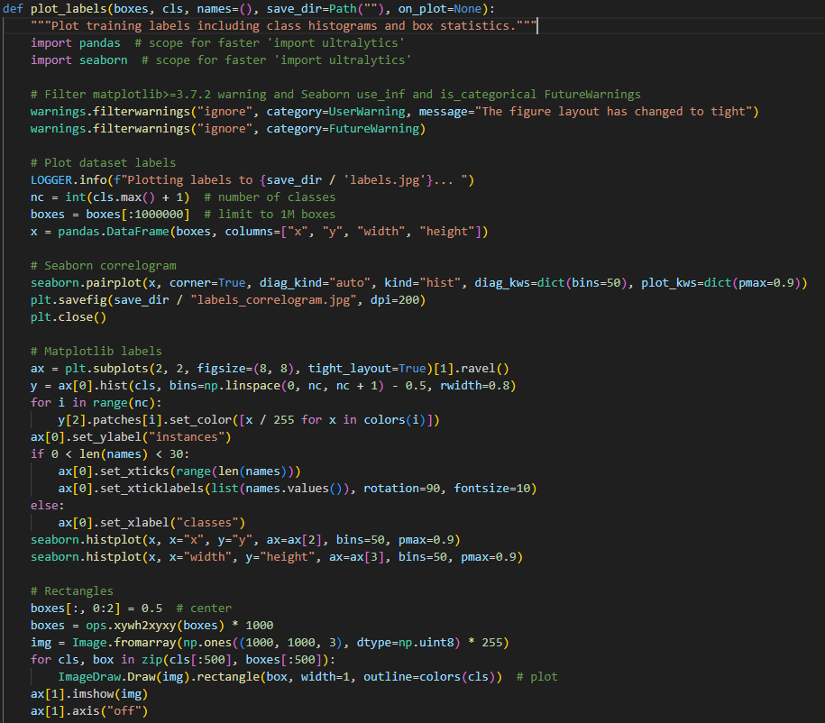

4条曲线和2个label图片

# 1、PR曲线 

### P曲线
横坐标是检测模型的置信度阈值，低于此阈值的判为负类，高于此阈值的判为正类。纵坐标是精确度（precision，查准率），即$\frac{检测正确的数量}{检测为正类的数量}$，当置信度阈值设置的比较低，一些误检的情况混入进来，此时精确度较低。当置信度升高，误检率下降，精确度提高。

### R曲线
横坐标是检测模型的置信度阈值，低于此阈值的判为负类，高于此阈值的判为正类。纵坐标是召回率（recall，查全率），即$\frac{检测正确的数量}{实际为正类的数量}$，当置信度阈值设置的比较低时，几乎所有的目标都被预测为正确，此时召回率较高。当置信度升高，部分正类目标无法被检测出来，此时召回率下降。

PR曲线的横坐标是召回率，纵坐标是精确度，当召回率升高时，精确度仍然较高，则表明模型的性能较优。

多个模型的PR曲线放在一张图上，则靠近右上角，能够包裹其他曲线的模型性能更优。

# 2、F1曲线

$F1=\frac{2PR}{P+R}$
当P=R时，F1最大
对于某个分类，综合了Precision和Recall的一个判断指标，F1-Score的值是从0到1的，1是最好，0是最差

简而言之就是想同时控制recall和precision来评价模型的好坏

# 3、AP

AP（Average Precision）是指每个类别的AP值，AP值越高，说明模型在这个类别上的性能越好。AP值是对每个类别的Precision-Recall曲线做平均，即对每个类别的PR曲线做一个平滑处理，然后求出AP值。AP值越高，说明模型在这个类别上的性能越好。
计算上时PR曲线的面积

mAP@0.5是指在IoU阈值为0.5时，所有类别的AP值的平均值。mAP@0.5越高，说明模型在所有类别上的性能越好。

# 4、labels

第一张图是每个类别实例的样本数量。 
第二张图是框的尺寸和数量，展示了训练集中边界框的大小分布以及相应数量。采样了训练集中的前500个数据。 
第三张图是中心点相对于整幅图的位置，描述了边界框中心点在图像中的位置分布情况。 
第四张图是目标相对于整幅图的高宽比例，反映了训练集中目标高宽比例的分布状况。 

# 5、labels_correlogram

标注框的数据分布情况，颜色矩阵是两个值之间相关系数的矩阵，越深代表相关性越强。 柱状图是该数据的分布情况，越高代表落在该值的数量越多。

# 6、plot code

