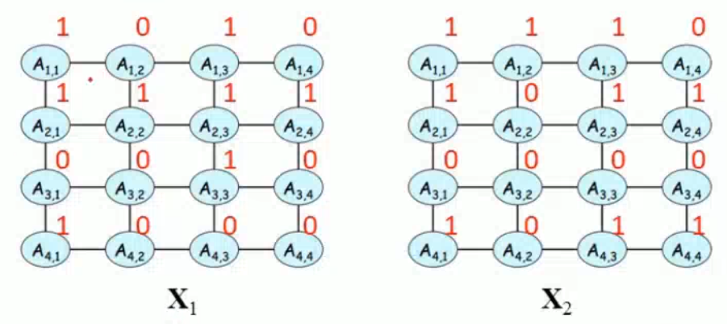

# 大数定律

在试验不变的条件下，重复试验多次，随机事件的频率近似于它的概率。

比如抛硬币无数次，最终得到的正反概率会趋近于{$\frac{1}{2},\frac{1}{2}$}

# 中心极限定理

从总体中抽样，抽样会服从正态分布且
$$
E[\bar X]=E[X]=\mu
$$
投骰子10次，求平均值，大致满足正太分布，中间值3.5

# 信息量

```
对信息量的定义：
	一个事件发生的概率越大，其所包含的信息量越少。
	一个事件发生的概率越小，其所包含的信息量越大。
	即事件发生所包含的信息量，与其所发生的概率是成反比的。
```

将信息量定义为
$$
事件X所包含的信息量:=f[P(X)]
$$


```
事件之间的信息量是相加的关系
但是事件发生的概率是相乘的关系
```

假设有两事件$A,B$，其中事件$A$先发生，事件$B$后发生，那么两个事件同时发生所包含的信息量，应该就是两个事件分别发生所包含信息量的和
$$
f[P(A)·P(B)]=f[P(A)]+f[P(B)]
$$
根据上述关系，我们选择$\log$函数作为描述信息量的公式
$$
f[P(X)]=\log_2[P(X)]
$$
其中$\log$是单调递增函数，不满足随事件发生概率增加，信息量减少的定义，所以我们为上述公式取反
$$
f[P(X)]=-\log_2[P(X)]
$$
上述公式即是对信息量的定义公式。

信息量就应该是一个事件从不确定，到确定的难度。

假如有$16~bit$存储空间，未输入时，任何一种可能性都是$\frac{1}{2^{16}}$​，当有数据存入后，这个数据的可能性变为1，将这个代入我们定义的信息量公式
$$
-\log_2[\frac{1}{2^{16}}]=16
$$


# 熵

```
熵所描述的是系统的混乱程度，即：
	熵越大，系统越紊乱，不确定性就越大
	熵越小，系统越平衡，不确定性就越小
```

假设第一种情况有两个事件$A,B$，$A$发生的概率是$0.99$，$B$发生的概率是$0.01$

假设第二种情况有两个事件$A,B$，$A$发生的概率是$0.5$，$B$发生的概率是$0.5$

很明显第二种情况的不确定性比第一种情况要大，所以第二种情况的熵就应该大于第一种情况

我们首先定义熵为系统内事件的信息量和，来计算这两种情况

定义
$$
系统内的熵:=H[P]
$$

$$
H[P]=\sum_i f[P(X_i)]
$$

对于第一种情况
$$
H[P]=-\log_2(0.99)-\log_2(0.01)=6.6583557595
$$
对于第二种情况
$$
H[P]=-\log_2(0.5)-\log_2(0.5)=2
$$
很明显这个结果与我们对熵的定义不符合。

事实上，在计算熵时，一个事件发生时才对这个系统有贡献，所以我们要考虑事件发生的概率，更改熵的公式定义
$$
H[P]=\sum_i P(X_i)f[P(X_i)]=-\sum_i P(X_i)\log_2[P(X_i)]
$$
利用更改后的熵公式计算两种情况的熵

对于第一种情况
$$
H[P]=-0.99*\log_2(0.99)-0.01*\log_2(0.01)=0.0807931359
$$
对于第二种情况
$$
H[P]=-0.5*\log_2(0.5)-0.5*\log_2(0.5)=1
$$
这个计算结果与我们对熵的定义完全符合。

# 似然

可以理解为引起某个现象的可能性

最小二乘法时概率密度是高斯分布时最大似然估计的特殊情况

问在投出10次硬币情况下，7次正，3次反的似然

那么在正反概率分布是$7:3$时，这个可能的结果概率最大，是$0.7^7*0.3^3=0.11$


$$
argmax_\theta \log P(X|\theta) = argmax_\theta f(X)
$$
log的好处就是把连乘变为连加

其中$\theta$表示未知参数，在各种参数下看那种参数带来的可能性最大

# KL散度

也叫相对熵，表示的是两个模型的相差程度。两个概率分布间差异的非对称性度量。是用来衡量同一个随机变量的两个不同分布之间的距离。

假设有两个模型$Q，W$，定义KL散度为
$$
KL[Q||W]
$$
表示以模型$Q$为基准，看模型$W$与模型$Q$相差多少

即Q是真实模型，W是拟合模型

> 具有非对称性

$KL[Q||W]\neq KL[W||Q]$

只有当$W$和$Q$的概率分布完全一样时才相等

> 具有非负性（吉布斯不等式）

$KL[Q||W]$恒大于等于0

只有当$W$和$Q$的概率分布完全一样时才等0
$$
KL(Q||W)=\sum_iQ_i(f(W_i)-f(Q_i))=\\ \sum_i Q_i(-log_2W_i-\log_2Q_i)=\\
\sum_iQ_i(-\log_2W_i)-\sum_iQ_i(-\log_2Q_i)
=\\H[Q,W]-H(Q)=\\交叉熵-熵
$$


# 交叉熵

主要用于度量同一个随机变量$X$的预测分布$W$与真实分布$Q$之间的差距

差距可理解为（距离、误差、失望值、困难程度、混乱程度）
$$
H[Q,W]=\sum_i Q_i(-log_2W_i)
$$
预测越准确，交叉熵越小

交叉熵只跟真实标签的预测概率值有关

简化公式
$$
Cross\_Entropy(Q,W)=-\log W
$$

> ##### 交叉熵二分类公式

$$
H[Q,W]=\sum_i Q_i(-log_2W_i)=\\
q(-\log w)+(1-q)(-\log(1-w))
$$

$q(x_1)+q(x_2)=1$，假设$q(x_1)=q$，则$q(x_2)=1-q$

$w(x_1)+w(x_2)=1$，假设$w(x_1)=w$，则$w(x_2)=1-w$

为什么在网络模型中，使用交叉熵做损失函数而不用KL散度做损失函数

当有真实分布时
$$
KL散度=交叉熵-信息熵=交叉熵-0=交叉熵
$$
所以用交叉熵，没有真实分布就用KL散度


# softmax函数

将数字转换成概率

进行数据归一化
$$
S_i=\frac{e^{z_i}}{\sum_{i=1}^ne^{z_i}}
$$


# sigmoid函数

也叫Logistic函数

取值范围（0，1）

常用的激活函数

常用于二分类
$$
S(x)=\frac{1}{1+e^{-x}}
$$
常见交叉熵损失函数类型

二分类：sigmoid + cross_entropy或者softmax + cross_entropy

多分类：softmax + cross_entropy

# 交叉熵损失函数

$$
loss(x,class)=-\log\frac{e^{x[class]}}{\sum_j e^{x[j]}}=-\log(e^{x[class]})+\log(\sum_j e^{x[j]})
$$

x是各个分类输出的具体数值

如果是三分类问题x=[23,15,88]

如果是四分类问题x=[77,15,88,56]

class是对应分类标签

如calss=[0]，对应三分类的23，对应四分类的77.

这些值通过softmax求概率。

第一步：用softmax算出各个类对应数值所占概率

第二步：求交叉熵

# 马尔可夫随机场

markov random fields，（MRF）的联合概率分布可以表示为以下分解形式
$$
p(x_1,\dots,x_n)=\frac{1}{Z_{\Phi}}\prod_{i=1}\phi_i(D_i)
$$
其中$Z_{\Phi}$为联合概率分布的归一化因子，通常称为配分函数。$D_i$是随机变量的集合，因子$\phi_i(D_i)$是从随机变量集合到实数域的一个映射，成为势函数或因子
$$
\Phi=\{\phi_i(D_i),\dots,\phi_K(D_K)\}\\
\tilde p(x_1,\dots,x_n)=\prod_{i=1}\phi_i(D_i)\\
Z_{\Phi}=\sum_{x_1,\dots,x_n}\tilde p(x_1,\dots,x_n)
$$


例子定义了边势函数，没有给出点势函数。每个点有两种取值，一共有四条边。每条边有四种状态

$Z_{\Phi}$就是因子乘积之和


增加节点势函数的定义

在计算机视觉和图像处理领域，成对马尔科夫随机场被广泛应用
$$
p(x_1,\dots,x_n)=\frac{1}{Z_{\Phi}}\prod_{p\in V}\phi_p(x_p)\prod_{(p,q)\in E}\phi_{pq}(x_p,x_q)
$$
其中$V$是节点集合，$E$是边集合

> #### 利用程度MRF对图像处理问题建模

图像处理问题转换为定义在MRF上的最大后验概率推理问题
$$
\max _x~p(x)\propto \prod_{p\in V}\phi_p(x_p)\prod_{(p,q)\in E}\phi_{pq}(x_p,x_q)
$$
看$x$取什么值时，对应的$p(x)$最大



上述问题等价于能量最小化问题，令
$$
\theta_p(x_p)=-\log\phi_p(x_p)\\
\theta_{pq}(x_p,x_q)=-\log\phi_{pq}(x_p,x_q)\\
$$
其中取对数是让连乘变连加，加负号使得最大值问题转换为最小值问题
$$
\min_x~E(x)=\sum_{p\in V}\theta_p(x_p)+\sum_{(p,q)\in E}\theta_{pq}(x_p,x_q)
$$


> #### 马尔科夫随机场应用在图像分割中

利用程度MRF对图像分割问题进行建模，定义变量如下：$x_p=1$，此像素点为前景；$x_p=0$，此像素点为背景。

假设图像具有连续性，即相邻像素的灰度值变化不大，则**边的势函数**定义为
$$
\theta_{pq}=
\left[
\begin{matrix}
0&2.5\\
2.5&0
\end{matrix}
\right]
$$
对应位置就是取值大小

$x_{00}$和$x_{11}$是位置相邻像素同是前景和背景。所以赋值是0，没有惩罚系数

$x_{01}$和$x_{10}$代表着相邻像素不是同一属性，所以有惩罚系数

根据原图像素特征定义**节点势函数**

$r$代表前景，$s$代表背景
$$
\theta_r=\left[
\begin{matrix}
1.5\\0
\end{matrix}
\right]
~~~~\theta_s=\left[
\begin{matrix}
0\\1.5
\end{matrix}
\right]
$$
第一个位置代表背景，所以前景势函数有惩罚项

第二个位置代表前景，所以背景势函数有惩罚项

> #### 马尔科夫随机场应用在图像去噪中

给定一副带有噪声的图像**$y$**，对图像进行去噪从而回复原图像**$x$**，利用最大后验概率状态推理来实现图像去噪
$$
p(true|noisy)=p(x|y)
$$
根据贝叶斯公式
$$
p(x|y)=\frac{P(y|x)p(x)}{p(y)}\propto p (y|x)p(x)
$$
可以进行等价是因为$p(y)$已经确定

转换为能量最小问题
$$
E(x)=-\log p(y|x)-\log p(x)\\=\sum_{p\in V}\theta_p(x_p)+\sum_{(p,q)\in E}\theta_{pq}(x_p,x_q)
$$
对于一个恢复之后的图像，我们同样希望这个图像时连续变化的，即相邻像素之间灰度值变化小，而且希望保留图像的边缘特征，所以边势函数定义为


对角线上即表示像素值连续变化，没有惩罚项

偏离对角线1个距离表示相邻像素偏差越大，越偏离惩罚项越大。

最大值被$d$限制，因为边缘存在特别大的像素值偏差，而我们希望保留边缘特征，所以对惩罚项设置一个上限。 

节点势函数，我们是希望去噪前和去噪后像素值相差不大，即$x_p$和$y_p$的取值接近

# 决策树

处理分类问题

> #### 属性选择的度量

熵
$$
entropy=-\sum^{n}_{i=1}p(i)\log_2 p(i)
$$
基尼系数
$$
Gini=1-\sum_{i=1}^{n}p(i)^2
$$
选择最小的属性作为根本度量


假设有数据

|  ID  | 是否有房 | 婚姻状况 | 年收入 | 是否拖欠贷款 |
| :--: | :------: | :------: | :----: | :----------: |
|  1   |    是    |   单身   |  125K  |      否      |
|  2   |    否    |   已婚   |  100K  |      否      |
|  3   |    否    |   单身   |  70K   |      否      |
|  4   |    是    |   已婚   |  120K  |      否      |
|  5   |    否    |   离异   |  95K   |      是      |
|  6   |    否    |   已婚   |  60K   |      否      |
|  7   |    是    |   离异   |  220K  |      否      |
|  8   |    否    |   单身   |  85K   |      是      |
|  9   |    否    |   已婚   |  75K   |      否      |
|  10  |    否    |   单身   |  90K   |      是      |

选择基尼系数作为选择的节点

选择一个基尼最小的作为根节点

```
例如：
以是否有房为例，有房者3，无房者7，有房者拖欠贷款0，未拖欠3；无房者拖欠贷款3，未拖欠贷款4
则Gini(有房)=1-(0^2+1^2)=0
Gini(无房)=1-((3/7)^2+(4/7)^2)
```

不断生长，直到全部标签确定。

# 马尔科夫链

随机生成

# EM算法

EM算法(期望最大算法)是一种迭代算法，用于含有隐变量的概率参数模型的最大似然估计或极大后验概率估计。具体思想如下：
EM算法的核心思想非常简单，分为两步：Expection-Step和Maximization-Step。E-Step主要通过观察数据和现有模型来估计参数，然后用这个估计的参数值来计算似然函数的期望值；而M-Step是寻找似然函数最大化时对应的参数。由于算法会保证在每次迭代之后似然函数都会增加，所以函数最终会收敛。

> #### 例子

假设两枚硬币A和B，他们的随机抛掷的结果如下图所示：


我们很容易估计出两枚硬币抛出正面的概率：
$$
\theta_A=\frac{24}{24+6}=0.80\\
\theta_B=\frac{9}{9+11}=0.45
$$
我们假如隐变量，抹去每轮投掷的硬币标记：


碰到这种情况，我们该如何估计$\theta_{A}$ 和$\theta_{B}$θ的值？
我们多了一个隐变量$Z=\left(z_{1}, z_{2}, z_{3}, z_{4}, z_{5}\right)$，代表每一轮所使用的硬币，我们需要知道每一轮抛掷所使用的硬币这样才能估$\theta_{A}$和$\theta_{B}$的值，但是估计隐变量 $Z$ 我们又需要知道$\theta_{A}$和$\theta_{B}$的值，才能用极大似然估计法去估计出 $Z$。这就陷入了一个鸡生蛋和蛋生鸡的问题。
其解决方法就是先随机初始化$\theta_{A}$和$\theta_{B}$ ，然后用去估计 Z， 然后基于 $Z$ 按照最大似然概率去估计新的$\theta_{A}$和$\theta_{B}$，循环至收敛。

> #### 计算

随机初始化$\theta_A=0.6$和$\theta_B=0.5$

对于第一轮来说，如果是硬币 A，得出的 5 正 5 反的概率为：$0.6^5*0.4^5$。如果是硬币 B，得出的 5 正 5 反的概率为：$0.5^5*0.5^5$，我们可以算出使7用是硬币 A 和硬币 B 的概率分别为：
$$
P_A=\frac{0.6^5*0.4^5}{0.6^5*0.4^5+0.5^5*0.5^5}=0.45\\
P_B=\frac{0.5^5*0.5^5}{0.6^5*0.4^5+0.5^5*0.5^5}=0.55
$$


从期望的角度来看，对于第一轮抛掷，使用硬币 A 的概率是 0.45，使用硬币 B 的概率是 0.55。同理其他轮。这一步我们实际上是估计出了 Z 的概率分布，这部就是 E-Step。
结合硬币 A 的概率和上一张投掷结果，我们利用期望可以求出硬币 A 和硬币 B 的贡献。以第二轮硬币 A 为例子，计算方式为：
$$
H:0.80*9=7.2\\
T:0.80*1=0.8
$$


然后用极大似然估计来估计新的和$\theta_A$和$\theta_B$

这步就对应了 M-Step，重新估计出了参数值。
如此反复迭代，我们就可以算出最终的参数值。


关于EM算法为什么会收敛

因为每次$\theta$更新时（每次迭代时），都可以得到更大的似然函数，也就是说极大似然函数时单调递增，那么我们最终就会得到极大似然估计的最大值。

但是要注意，迭代一定会收敛，但不一定会收敛到真实的参数值，因为可能会陷入局部最优。所以 EM 算法的结果很受初始值的影响。
